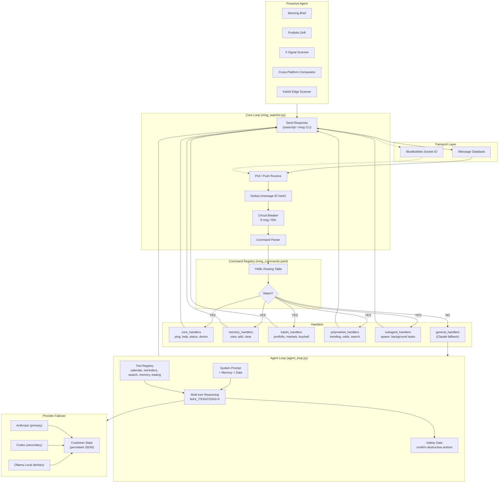

# How Rout Works

Rout has three moving parts: a **watcher**, a **command registry**, and **handlers**. Understanding these three concepts explains the entire system.

## Architecture



## The Loop

```
You send an iMessage
  → The watcher sees it
    → The command registry checks if it matches a known command
      → YES: routes to the matching handler
      → NO:  routes to Claude (the fallback handler)
        → The handler returns a response string
          → The watcher sends it back as an iMessage
```

That's it. Every feature in Rout — calendar, reminders, web search, image analysis, natural conversation — follows this exact flow.

## Key Concepts

### Watcher

The watcher is Rout's main process. It polls your iMessage database every 2 seconds looking for new messages, decides what to do with each one, and sends the response back. There is only one watcher — it's the orchestrator that ties everything together.

The watcher runs as a macOS `launchd` service, which means it starts automatically on login, restarts itself after crashes, and texts you if it goes down unexpectedly. When you run `./start_watcher.sh`, you're starting this process. When you run `./stop_watcher.sh`, you're stopping it.

The watcher doesn't contain any logic about _what_ to do with messages — it only knows _how_ to receive them and send responses. All actual behavior lives in handlers.

**Key file:** `comms/imsg_watcher.py`

### Handler

A handler is a Python function that does one thing. It takes a string (the user's message or parsed arguments), does some work, and returns a string (the response). That's the entire interface.

```python
def ping_command(args: str = "") -> str:
    return "🏓 Pong!"
```

Every capability in Rout is a handler: `ping` is a handler, `help` is a handler, `memory: view` is a handler, and the full Claude conversation engine is also a handler. They all follow the same pattern — input string, output string.

Handlers are organized by domain in the `handlers/` directory:

| File | What it handles |
|---|---|
| `core_handlers.py` | System commands: help, status, ping, doctor |
| `general_handlers.py` | Claude conversations, calendar, reminders, web search, images |
| *(your_handlers.py)* | Add your own — any `_command` function is auto-registered |
| `memory_handlers.py` | Persistent memory: view, add, clear |

Handlers are loaded dynamically at startup — any file in `handlers/` with functions ending in `_command` gets registered automatically. You never need to modify the watcher to add a new capability.

### Command Registry

The command registry (`imsg_commands.yaml`) is the routing table that maps trigger phrases to handler functions. When you text "memory: view", the registry tells the watcher to call `memory_handlers.view_command`.

```yaml
memory:view:
  trigger: "memory: view"
  description: "Show persistent memory"
  handler: "memory_handlers.view_command"
```

If a message doesn't match any registered command, it falls through to the **fallback handler** — `general_handlers.claude_command` — which routes it to Claude as a natural conversation. This is why you can text Rout anything and get a useful response: unrecognized messages aren't errors, they're conversations.

### Provider (and Failover)

A provider is an AI backend that generates responses. Rout supports three providers in a priority chain:

1. **Anthropic** (primary) — Claude via the Anthropic API
2. **Codex** (secondary) — OpenAI Codex via CLI, activated automatically if Anthropic hits a rate limit
3. **Local model** (last resort) — An on-device model via Ollama, used when both cloud providers are rate-limited

Provider failover is automatic and invisible to the user. If Anthropic returns a 429 (rate limit), Rout reads the `Retry-After` header, puts Anthropic on cooldown, and immediately retries with Codex. When the cooldown expires, Rout switches back to Anthropic and texts you that it's back online.

Each provider tracks its own cooldown state in a persistent JSON file, so cooldown timers survive watcher restarts.

### Memory

Memory gives Rout persistent context about you — your name, preferences, family, routines — so you never repeat yourself. It's injected into every Claude prompt as a system-level context block.

Rout uses a two-tier memory system: a **vector store** (ChromaDB with Ollama embeddings) for semantic retrieval, backed by a **markdown file** (`MEMORY.md`) as a human-readable fallback. Every memory is stored in both tiers. If ChromaDB or Ollama aren't available, Rout gracefully degrades to injecting the full MEMORY.md contents.

You can manage memory through iMessage commands:

- `memory: view` — see what Rout knows
- `memory: add <note>` — append a new note
- `memory: clear CONFIRM` — reset everything

Memory is local-only and never leaves your machine (except as part of API calls to your configured AI provider).

### Circuit Breaker

The circuit breaker is a safety mechanism that prevents Rout from sending too many iMessages in a short window. By default, it allows 8 messages per 60 seconds. If that limit is exceeded, it trips and enters an exponential cooldown (1 min → 2 min → 4 min, up to 1 hour max).

This protects against infinite loops, runaway handlers, or any situation where Rout might flood your iMessage thread. Circuit breaker state is persisted to disk, so it survives restarts.

### Plugin SDK

For simple handlers, the basic `def my_command(args: str) -> str` interface is all you need. For handlers that need richer context — who sent the message, which chat it came from, whether attachments are present — the Plugin SDK provides typed contracts:

```python
from sdk.command_contract import context_from_inputs, text_result

def my_command(args=None, message="", sender=None, metadata=None):
    ctx = context_from_inputs(args=args, message=message, sender=sender, metadata=metadata)
    # Now you have ctx.sender_name, ctx.chat_id, ctx.is_group, ctx.attachments, etc.
    return text_result(f"Hello {ctx.sender_name}").text
```

The SDK is optional — all existing handlers work with or without it.

### Skills (and How They Differ from OpenClaw Skills)

Rout is built on [OpenClaw](https://openclaw.ai), and both use the same skill format: a folder containing a `SKILL.md` file with structured instructions, workflows, quality gates, and reference materials. An OpenClaw skill is a markdown document that tells an AI agent how to behave in a specific domain — it's not code, it's a playbook.

Rout ships four skills in the `skills/` directory:

| Skill | What it does |
|---|---|
| `oss-community-operations` | Audits and maintains open-source governance files (CODE_OF_CONDUCT, SECURITY, etc.) |
| `oss-contributor-onboarding` | Guides first-time contributors from zero to a review-ready PR |
| `rout-release-legal` | Pre-release checklist for license, metadata, and contributor readiness |
| `rout-reliability-testing` | Enforces test coverage and validation for runtime changes |

These are development workflow skills — they're used by Codex and other AI agents when working on the Rout codebase itself, not by the iMessage watcher at runtime.

**The key difference from OpenClaw's ClawHub marketplace:** Rout skills are bundled in-repo, version-controlled, and reviewed. You can read every line before they touch your system.

OpenClaw's ClawHub is a public marketplace where anyone can publish skills. In February 2026, security researchers found that [roughly 12% of all ClawHub skills were malware](https://www.pixee.ai/weekly-briefings/openclaw-malware-ai-agent-trust-2026-02-11) — 341 out of 2,857 audited packages were distributing credential stealers, with the primary payload being Atomic macOS Stealer (AMOS). The [#1 ranked skill on ClawHub had 9 security vulnerabilities](https://awesomeagents.ai/news/openclaw-clawhub-malware-supply-chain/), two critical, and was silently exfiltrating user data. [91% of the malicious skills included prompt injection](https://www.trendmicro.com/en_us/research/26/b/openclaw-skills-used-to-distribute-atomic-macos-stealer.html) — they didn't just attack the user, they attacked the AI agent itself, manipulating it into executing commands and sending data to external servers. Belgium's Centre for Cybersecurity and China's MIIT both issued emergency advisories.

OpenClaw has since [partnered with VirusTotal](https://blog.virustotal.com/2026/02/from-automation-to-infection-how.html) to scan skill uploads, but the incident is a cautionary example of what happens when AI agent extensibility ships without supply chain security.

**If you install skills from ClawHub into your OpenClaw environment, those skills can interact with Rout.** Treat third-party skills with the same scrutiny you'd give any code that runs on your machine with access to your iMessage, calendar, and API keys. Rout's bundled skills are safe. Anything you download from a public marketplace is your responsibility to audit.

## How a Message Becomes a Response (Full Path)

Here's what happens end-to-end when you text Rout "what's on my calendar today":

1. **Poll** — The watcher's polling loop calls `imsg history` and gets your message from the Messages.app SQLite database
2. **Dedup** — The watcher checks the message ID against its processed set to avoid responding twice
3. **Parse** — The command parser checks the text against the command registry. "what's on my calendar today" doesn't match any trigger, so it falls through
4. **Fallback** — The watcher routes to the `general:claude` handler
5. **Intent detection** — `general_handlers.py` scans for keywords. "my calendar" matches `CALENDAR_READ_KEYWORDS`
6. **Data fetch** — The handler calls Calendar.app via `osascript` to get today's events
7. **Claude call** — The handler sends your message + calendar data + memory context to Claude via the Anthropic API (with automatic Codex fallback if rate-limited)
8. **Response** — Claude generates a natural language summary of your day
9. **Send** — The watcher sends the response back via `osascript` (with `imsg` CLI as fallback)
10. **State** — The message ID is saved to the processed set so it won't be handled again
