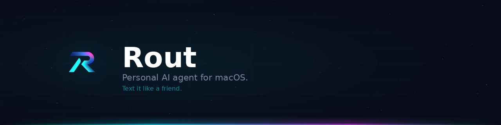

<p align="center">
  
</p>

# Rout — Personal AI Agent for macOS

Every AI assistant makes you leave what you're doing. Open a browser. Switch apps. Lose your train of thought. Rout lives in iMessage — the app you already have open. Text it. Get answers. Stay in flow.

Built on [OpenClaw](https://openclaw.ai). Runs as a launchd service on macOS.

**[→ View the project page](https://kingmadellc.github.io/rout/)**

**Current release: v0.8.0** — Initial public release. Full-featured personal AI agent with prediction market intelligence, proactive alerts, personality engine, and provider failover. Pre-release — expect rough edges.

---

## What It Does

Text Rout like you'd text a friend. It reasons through multi-turn conversations, calls tools, and responds — all inside Messages.app.

```
You:   What's on my calendar today?
Rout:  You've got 3 things today:
       • Team standup @ 9:30 AM
       • Dentist appointment @ 1:00 PM
       • Pick up groceries @ 5:30 PM

You:   Move the dentist to Thursday at 2pm
Rout:  Create event on Personal calendar?
       📅 Dentist appointment — Thursday at 2:00 PM
       Reply yes or no.

You:   spawn: research the latest AI policy news
Rout:  ✅ Subagent spawned. You'll get an iMessage when it's done.
```

## Capabilities

| | |
|---|---|
| **Conversational agent** | Multi-turn Claude reasoning with tool use, safety gate, and persistent memory |
| **Calendar & Reminders** | Read, create, and modify events and reminders via natural language |
| **Prediction markets** | Kalshi + Polymarket — portfolio, positions, market search, cross-platform comparison |
| **Edge Engine** | Kalshi + Polygon.io + local Qwen — real probability estimation and mispricing detection |
| **Personality Engine** | 6-system behavior layer — editorial voice, back-references, variable timing, selective silence, micro-initiations, engagement-adaptive response tracking |
| **Crypto** | Coinbase read-only — balances, prices, portfolio overview |
| **Web + X search** | DuckDuckGo + local Qwen signal scanner, zero API cost |
| **Image analysis** | Send a photo, get a description |
| **Subagents** | `spawn:` background tasks — Rout texts you when done |
| **Morning brief** | Daily digest with market exits, divergences, X signals, prices |
| **Proactive triggers** | 7-trigger proactive agent + personality pipeline — every outbound message runs through urgency, silence, editorial, and timing gates |
| **Webhook server** | HTTP endpoint for external services to trigger iMessage alerts |
| **Provider failover** | Anthropic → Codex → Ollama (local) with auto-swap watchdog + Qwen tool calling |
| **Real-time transport** | BlueBubbles Socket.IO push with polling fallback |

## Edge Engine

Replaces simple spread heuristics with a real probability estimation pipeline:

```
Kalshi API (paginated, 3000+ markets)
  → Blocklist filter (weather, entertainment, sports, intraday noise)
  → Volume + timeframe filter (7-365 days, your sweet spot)
  → Event deduplication (ticker-stem grouping)
  → Polygon.io enrichment (SPY, VIX proxy, BTC, Gold + related news)
  → Local Qwen probability estimation (de-anchored from market price)
  → Edge = |market_implied - qwen_estimate|
  → Alert on edge ≥ 12% via iMessage
```

**Key design decisions:**
- Blocklist > allowlist — block known garbage (weather, sports, entertainment), let everything else through to Qwen
- Thin markets = where mispricing lives — low volume floor (10 contracts)
- Event dedup prevents wasting Qwen budget on 8 variants of the same question
- Polygon enrichment is optional — engine works without an API key, just with less context

## Personality Engine

Every proactive message routes through `personality_send()` — a 6-system pipeline that wraps the raw trigger output:

```
Trigger fires (edge engine, X signals, etc.)
  → Selective silence: is this data boring/stale? Skip or send "nothing worth your time"
  → Urgency scoring: 0.0-1.0 based on trigger type, data magnitude, time-of-day
  → Engagement modifier: adapts urgency based on which triggers you actually read
  → Variable timing: send/hold decision (cluster throttle, daily fatigue, weekend dampening)
  → Context buffer: back-reference earlier messages ("That divergence I flagged this morning...")
  → Editorial voice: prepend 1-2 sentence opinion on market data
  → Dedup check → Send via iMessage
```

**The 6 systems:**

| System | What it does |
|--------|-------------|
| Editorial Voice | Forms opinions on market data. Randomized pools per trigger type. |
| Context Buffer | Tracks all outbound messages daily. Generates back-references to earlier alerts. |
| Variable Timing | Urgency-based send/hold. Adjusts for time-of-day, clustering, daily message count. |
| Selective Silence | Content quality gate. Suppresses flat/stale data. Sends deliberate silence messages (max 1/day). |
| Micro-Initiations | Ambient awareness pings. Max 2/week, context-aware (quiet markets, weekends, absence). |
| Response Tracking | Tracks engagement per trigger type. Low-engagement triggers get higher urgency thresholds. |

All 6 systems are individually toggleable in `config/proactive_triggers.yaml` under the `personality:` section. Force mode (`--only`) bypasses personality for raw output.

## Architecture

```
┌──────────────────────────────────────────────────────┐
│                    macOS (launchd)                    │
├──────────────────────────────────────────────────────┤
│                                                      │
│  imsg-watcher         → Core message loop (KeepAlive)│
│  webhook-server       → Port 7888 (KeepAlive)        │
│  proactive-agent      → 15-min interval, 7 triggers + personality │
│  log-rotation         → Daily 3 AM cleanup           │
│                                                      │
├──────────────────────────────────────────────────────┤
│                                                      │
│  Agent Layer          → Claude + tool dispatch        │
│  Handler Layer        → Kalshi, Polymarket, Coinbase  │
│  Proactive Layer      → Edge engine, X signals,       │
│                         cross-platform, portfolio,    │
│                         calendar, morning brief       │
│  Personality Layer    → Editorial, timing, silence,   │
│                         context, engagement tracking  │
│  Transport Layer      → BlueBubbles Socket.IO push    │
│                                                      │
└──────────────────────────────────────────────────────┘
```

## File Structure

```
rout/
├── agent/                  # Core AI agent + tool dispatch
│   ├── agent.py            # Multi-turn Claude reasoning loop
│   ├── tools/              # Tool definitions (calendar, reminders, web, etc.)
│   └── memory.py           # Persistent memory (MEMORY.md)
├── comms/                  # Transport layer
│   └── imsg_watcher.py     # BlueBubbles Socket.IO + iMessage bridge
├── config/                 # Configuration
│   ├── loader.py           # Centralized config manager
│   └── proactive_triggers.yaml  # Trigger scheduling + thresholds
├── handlers/               # API integration handlers
│   ├── kalshi_handlers.py  # Kalshi: portfolio, markets, buy/sell
│   ├── polymarket_handlers.py  # Polymarket: Gamma + CLOB APIs
│   ├── general_handlers.py # Calendar, reminders, web, image
│   └── shared.py           # DRY config, HTTP, formatting utilities
├── scripts/
│   └── proactive/          # Proactive agent system
│       ├── __init__.py     # Trigger orchestrator + rate limiter
│       ├── base.py         # Shared infra (config, state, locking, messaging)
│       ├── proactive_agent.py  # Entry point (launchd target)
│       ├── personality/    # Behavior layer
│       │   ├── engine.py           # Orchestrator: personality_send()
│       │   ├── editorial_voice.py  # Opinion generation per trigger
│       │   ├── context_buffer.py   # Daily message tracking + back-refs
│       │   ├── variable_timing.py  # Urgency-based send/hold
│       │   ├── selective_silence.py # Content quality gate
│       │   ├── micro_initiations.py # Ambient awareness pings
│       │   └── response_tracker.py  # Engagement-adaptive thresholds
│       └── triggers/
│           ├── edge_engine.py    # Kalshi + Polygon + Qwen
│           ├── polygon_data.py   # Polygon.io data layer (cached)
│           ├── qwen_analyzer.py  # Local Qwen probability estimation
│           ├── cross_platform.py # Kalshi vs Polymarket divergence
│           ├── x_signals.py      # DDG + Qwen X/Twitter signals
│           ├── morning.py        # Daily briefing
│           ├── meeting.py        # Meeting reminders
│           ├── portfolio.py      # Position drift alerts
│           └── conflicts.py      # Calendar conflict checker
├── launchd/                # macOS service definitions
├── webhooks/               # Webhook server
├── docs/                   # Architecture docs, handler SDK
├── skills/                 # Specialist agent skills
└── tests/                  # Test suite
```

## Proactive Triggers

| Trigger | Interval | What it does |
|---------|----------|-------------|
| Edge Engine | 3 hours | Scans Kalshi for mispriced markets, estimates probability with local Qwen, alerts on edge ≥12% |
| Cross-Platform | 4 hours | Kalshi vs Polymarket price divergence detection |
| X Signal Scanner | 2 hours | DDG search for X/Twitter signals matching active positions |
| Meeting Reminders | 15 min | Heads-up 30 minutes before calendar events |
| Portfolio Drift | 1 hour | Alert on position moves ≥5% |
| Calendar Conflicts | Daily | Evening check for tomorrow's scheduling overlaps |
| Morning Brief | Disabled | Replaced by Claude Code cron job |

All triggers share a rate limit of 3 proactive messages per hour. PID lockfile prevents concurrent runs.

## Quick Start

**Requirements:** Mac running macOS 12+, [OpenClaw](https://openclaw.ai), Python 3.10+, [imsg CLI](https://github.com/nicholasstephan/imsg). Optional: [BlueBubbles](https://bluebubbles.app/), [Ollama](https://ollama.com) (required for Edge Engine + X signals), [Polygon.io API key](https://polygon.io) (optional enrichment).

```bash
git clone https://github.com/kingmadellc/rout.git
cd rout
chmod +x setup.sh && ./setup.sh
```

1. Copy `config.yaml.example` → `config.yaml` — add your chat IDs
2. Copy `MEMORY.md.example` → `MEMORY.md` — give Rout context about you
3. `./start_watcher.sh` — text yourself `ping` to verify

> macOS will ask for Full Disk Access for your terminal so Rout can read the iMessage database. System Settings → Privacy & Security → Full Disk Access.

### Edge Engine Setup (optional)

The edge engine requires Ollama with Qwen for probability estimation:

```bash
# Install Ollama (if not already)
brew install ollama

# Pull Qwen model
ollama pull qwen3:latest

# Optional: Polygon.io enrichment (free tier works)
export POLYGON_API_KEY='your-key-here'
# Or add to ~/.openclaw/config.yaml under polygon.api_key
```

## Development

```bash
python -m pytest tests/ -v
python3 -m py_compile comms/imsg_watcher.py handlers/*.py agent/*.py agent/tools/*.py
```

Dry-run the edge engine:
```bash
python3 scripts/proactive_agent.py --only edge --dry-run
```

See [`docs/`](docs/) for architecture details, the handler SDK, subagent usage, and the system monitor.

See [`skills/`](skills/) for specialist agent skills (integration scaffolding, pipeline debugging, deploy ops, debug tracing).

## Privacy

Rout runs entirely on your Mac. Messages, calendar data, and memory stay on your machine. The only external calls are to your configured AI provider for generating responses and optionally Polygon.io for market data enrichment. No telemetry, no analytics, no third-party services.

## Contributing

See [CONTRIBUTING.md](CONTRIBUTING.md), [CODE_OF_CONDUCT.md](CODE_OF_CONDUCT.md), and [SECURITY.md](SECURITY.md).

## License

MIT. See [LICENSE](LICENSE).

---

<p align="center">
  Built by <a href="https://github.com/kingmadellc">KingMade LLC</a> · Powered by <a href="https://openclaw.ai">OpenClaw</a>
</p>
