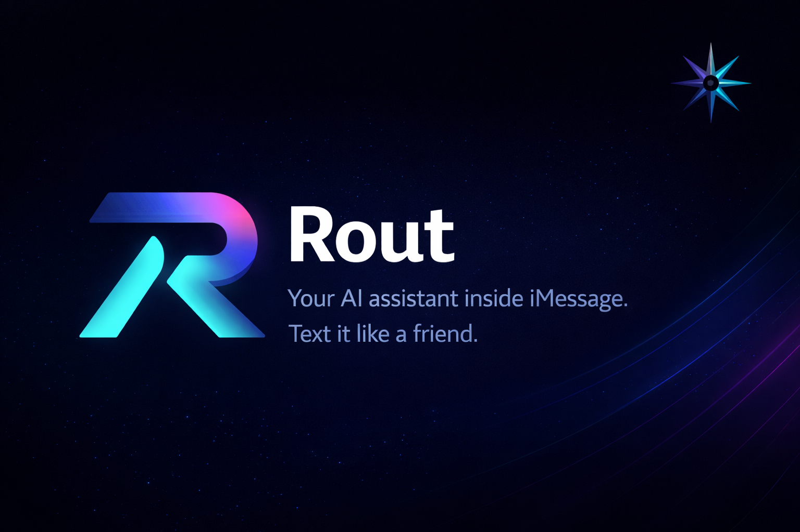

<p align="center">
  
</p>

<p align="center">
  
  
  
</p>

# Rout — Personal AI Agent Framework for macOS

Rout is an extensible AI agent that lives in your iMessage. It routes natural language to Claude, executes structured commands, manages your calendar and reminders, monitors prediction markets, and auto-recovers from crashes — all from a single text thread.

Built on [OpenClaw](https://openclaw.ai). Ships with a plugin SDK so you can add any capability in minutes.

## Demo

<p align="center">
  
</p>

## Why Rout

Most AI assistants are chat windows you have to go to. Rout meets you where you already are — your texting app. No new apps, no browser tabs, no context switching.

- **One interface for everything** — text it like you'd text a friend. It figures out what you need.
- **Extensible by design** — every capability is a handler. Add yours in minutes, not days.
- **Provider failover** — auto-switches between Anthropic and Codex OAuth when either enters cooldown. Zero downtime.
- **Persistent memory** — knows your name, your preferences, your context. Across every conversation.
- **Crash-proof** — launchd auto-restarts the watcher and texts you if it goes down.

## Capabilities

| Capability | What It Does |
|---|---|
| **Natural conversation** | Routes free-form messages to Claude with full conversation history |
| **Image analysis** | Send a photo, get a description and analysis |
| **Web search** | Auto-triggered on news, current events, or factual queries |
| **Calendar** | Read today's events or add new ones ("add dentist Friday at 2pm") |
| **Reminders** | "Remind me in 45 minutes to call the school" |
| **Tasks** | "Add buy milk to my reminders" |
| **Kalshi trading** | Live portfolio monitoring, exit alerts, position commands |
| **Memory management** | View, add, or clear persistent context |
| **Crash recovery** | Auto-restarts via launchd, alerts you on failure |

## Quick Start

### Requirements

- macOS (uses Messages.app, Calendar.app, Reminders.app)
- [OpenClaw](https://openclaw.ai) installed and configured with an Anthropic API key
- [imsg CLI](https://github.com/nicholasstephan/imsg) (`brew install imsg`)
- Python 3.9+

### Install

```bash
git clone https://github.com/kingmadellc/rout.git
cd rout
chmod +x setup.sh && ./setup.sh
```

`setup.sh` checks for dependencies before installing anything — safe to re-run.

### Configure

1. **Fill in `config.yaml`** — add your chat IDs, name, and optional Kalshi credentials
   - Run `imsg list --json` to find your chat ID
2. **Edit `MEMORY.md`** — give your agent context about you (family, preferences, routines)
3. **Start**: `./start_watcher.sh`
4. **Test**: text yourself `ping`

### Update

```bash
git pull
```

Your `config.yaml` and `MEMORY.md` are in `.gitignore` — updates are code-only.

## Commands

Text these to yourself via iMessage:

| Command | Description |
|---|---|
| `ping` | Test connectivity |
| `help` | List all commands |
| `status` | Check watcher status |
| `doctor` | Run installation diagnostics |
| `memory: view` | Show persistent memory |
| `memory: add <note>` | Append to memory |
| `kalshi: portfolio` | Balance + positions |
| `kalshi: markets` | Top opportunities from cache |
| `kalshi: cache` | Research cache status |
| *(anything else)* | Routed to Claude for a natural response |

## Build Your Own Handler

Every capability in Rout is a handler — a Python function that takes a string and returns a string. Adding one takes 3 steps:

**1. Create a handler file**

```python
# handlers/weather_handlers.py

def forecast_command(args: str = "") -> str:
    """Get the weather forecast"""
    city = args.strip() or "San Francisco"
    # Your logic here
    return f"Weather for {city}: 72°F, sunny"
```

**2. Register it**

```yaml
# imsg_commands.yaml
weather:forecast:
  trigger: "weather: forecast"
  description: "Get weather forecast for a city"
  handler: "weather_handlers.forecast_command"
  args: ["city"]
```

**3. Restart**

```bash
./stop_watcher.sh && ./start_watcher.sh
```

That's it. Your command is live. Text `weather: forecast Seattle` and it works.

For typed contracts and richer context (sender info, chat ID, attachments), see the [Plugin SDK](docs/PLUGIN_SDK.md).

## Architecture

```
iMessage
  └─ imsg CLI polls Messages.app SQLite DB
       └─ imsg_command_watcher.py
            ├─ Structured commands → handlers/*.py
            └─ Free-form text → general_handlers.py
                  ├─ Claude API (primary)
                  ├─ Codex CLI (automatic failover)
                  ├─ Web search (auto-triggered)
                  ├─ Calendar.app (read/write via osascript)
                  ├─ Reminders.app (tasks via osascript)
                  └─ Kalshi API (optional, live trading data)
```

The watcher is handler-agnostic. All logic lives in `handlers/`. The core loop never changes — you only add capabilities.

## File Structure

```
comms/
  imsg_watcher.py          Main polling loop
  mock_send.py             Mock mode for testing without iMessage
config/
  *.py                     Config loading and validation
handlers/
  core_handlers.py         help, status, ping, doctor
  general_handlers.py      Claude, calendar, reminders, web search, images
  kalshi_handlers.py       Trading commands
  memory_handlers.py       Memory view, add, clear
  example_handlers.py      Template for new handlers
sdk/
  command_contract.py      Typed context and result contracts
docs/
  PLUGIN_SDK.md            Plugin SDK documentation
  index.html               Documentation site
config.yaml.example        Config template (copy → config.yaml)
MEMORY.md.example          Memory template (copy → MEMORY.md)
setup.sh                   One-time setup
start_watcher.sh           Start via launchd
stop_watcher.sh            Stop watcher
kalshi_exit_monitor.py     Hourly exit alert daemon
```

## Logs

```bash
tail -f imsg_watcher.log
tail -f kalshi_exit_monitor.log
```

## Stop / Uninstall

```bash
./stop_watcher.sh
launchctl unload ~/Library/LaunchAgents/com.rout.kalshi-monitor.plist
```

## Development

```bash
# Compile check
python3 -m py_compile comms/imsg_watcher.py comms/mock_send.py handlers/*.py config/*.py trading/*.py kalshi_exit_monitor.py

# Run tests
python3 -m unittest discover -s tests -p 'test_*.py'

# Mock mode (no iMessage required)
ROUT_OPENCLAW_DIR=/tmp/rout-openclaw ROUT_MOCK_MODE=1 python3 comms/imsg_watcher.py
ROUT_OPENCLAW_DIR=/tmp/rout-openclaw python3 comms/mock_send.py "/help"
tail -f /tmp/rout-openclaw/logs/mock_outbox.jsonl
```

## Contributing

See [CONTRIBUTING.md](CONTRIBUTING.md), [CODE_OF_CONDUCT.md](CODE_OF_CONDUCT.md), and [SECURITY.md](SECURITY.md).

## License

MIT. See [LICENSE](LICENSE).

---

<p align="center">
  Built by <a href="https://github.com/kingmadellc">KingMade LLC</a> · Powered by <a href="https://openclaw.ai">OpenClaw</a>
</p>
